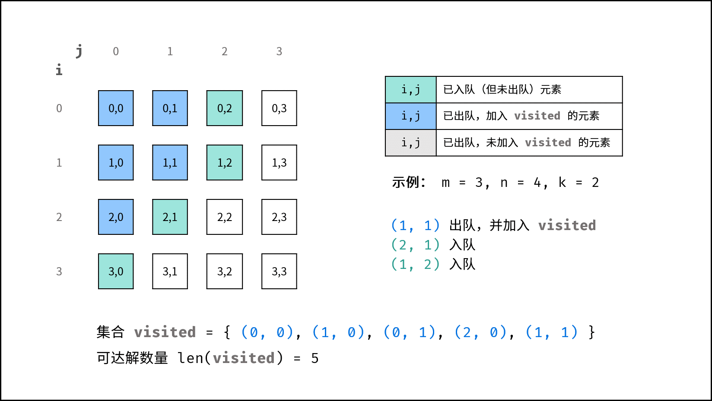

# Offer13

## Question:

There is a $m*n$ square grid, a robot start moving from $[0,0]$ and it can move one square at a time to the left, right, up or down (cannot move outside the square), and it cannot enter a square where the sum of the digits of the row and column coordinates is greater than $k$. For example, when $k$ is $18$, robot can enter square $[35,37]$ because $3+5+3+7=18=k$ . But it cannot enter square $[35,38]$ because $3+5+3+8=19>k$ . How many squares can the robot reach?

__exp.1:__

> Input: m = 2, n = 3, k = 1
>
> Output: 3 
>

__exp.2:__

> Input: m = 3, n = 1, k = 0
>
> Output: 1

__Tips:__

> $1\leq m,n \leq 100$ 
>
> $0 \leq k \leq 20$ 

## Solution:

- The sum of the digits of `num`.

```java
public int judge(int num) {
    int sum = 0;
    while (num > 0) {
        sum += num % 10;
        num /= 10;
    }
    return sum;
}
```

- **DFS:**

	- __Recursive parameters:__ visit array: `visit[m][n]`, currently position: `x` ,`y`, target value: `k`.

	- **Stop condition:**  When `x` or `y` greater than `m` or `n`; the sum of the digits of coordinates is greater than `k`; currently position is visited (visit$[x][y]$=`true`), return 0 (reps don't count towards reachable solutions).

	- **Recursive work:** 
		
		1. Mark current square in visit array;
		2. Search next square, down or right.
		
	- **Recall return value:** return 1+`Total number of reachable solutions for the right side search`+`total number of solutions for the left side search`, reps the total number of reachable solutions recursively searched from this cell.
	
	- Time: $O(MN)$ , Space: $O(MN)$.
	
		
	
		
	
		
		
		
		
		
		
		
		
		
		
		
		
		
		
		
		
		
		
		

```java
class Solution {
    public int movingCount(int m, int n, int k) {
        boolean[][] visit = new boolean[m][n];
        int count = findWay(visit, 0, 0, k);
        return count;
    }

    public int findWay(boolean[][] visit, int x, int y, int k) {
        if (x >= visit.length || y >= visit[0].length || judge(x) + judge(y) > k || visit[x][y]) return 0;
        visit[x][y] = true;
        return findWay(visit, x + 1, y, k) + findWay(visit, x, y + 1, k) + 1;
    }

    public int judge(int num) {
        int sum = 0;
        while (num > 0) {
            sum += num % 10;
            num /= 10;
        }
        return sum;
    }
}
```


- **BFS:**

  - **Initial:** put $[0,0]$ into `queue`.

  - **Stop condition:** queue is empty.

  - **Recursive work:** 

    1. poll the head cell of the `queue` , search current cell;
    	2. Judge whether to skip: `x` or `y` greater than `m` or `n`; the sum of the digits of coordinates is greater than `k`; currently position is visited (visit$[x][y]$=`true`);
    	3. Mark current cell: visit$[x][y]$ = true;
    	4. Add the cells below and to the right of the current element to the queue。

    - **Return value:** set `res` to count the number of reachable solutions.

  - Time: $O(MN)$, Space: $O(MN)$.

  

  

  

  

  

  

  

  

  

```java
class Solution {
    public int movingCount(int m, int n, int k) {
        boolean[][] visited = new boolean[m][n];
        int res = 0;
        Queue<int[]> queue= new LinkedList<int[]>();
        queue.add(new int[] { 0, 0, 0, 0 });
        while(queue.size() > 0) {
            int[] x = queue.poll();
            int i = x[0], j = x[1], si = x[2], sj = x[3];
            if(i >= m || j >= n || k < si + sj || visited[i][j]) continue;
            visited[i][j] = true;
            res ++;
            queue.add(new int[] { i + 1, j, (i + 1) % 10 != 0 ? si + 1 : si - 8, sj });
            queue.add(new int[] { i, j + 1, si, (j + 1) % 10 != 0 ? sj + 1 : sj - 8 });
        }
        return res;
    }
}
```

